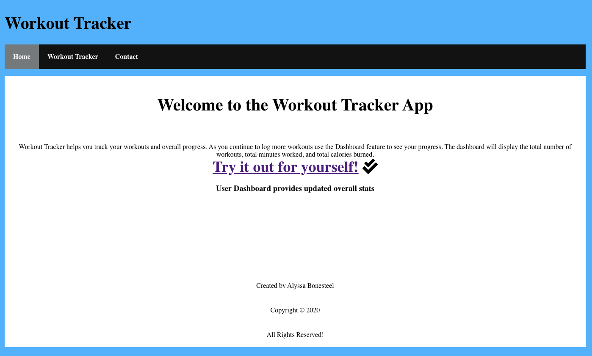

Name of App: Workout Tracker App

Live Link: https://workout-tracker-eosin.now.sh

Documentation of API: https://github.com/Bones02/workout-server.git

Screenshots:

Summary: The workout tracker allows users to enter workouts and record calories, minutes and workout type. The user may add a workout type and add workouts under that type. This allows users to clearly sort their workouts by type to help view progress. The dashboard feature totals the calories, minutes, and workouts to provide the user up to date data on their workouts. 

Technologies Used: React, Node, Express, Javascript, Html, and CSS

